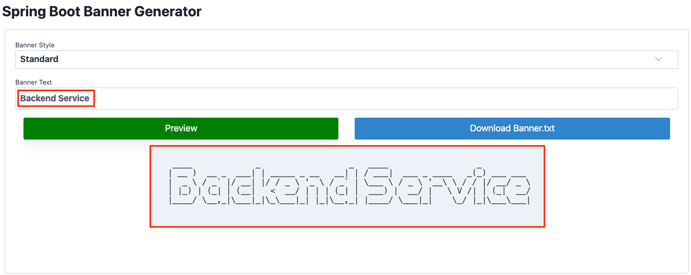
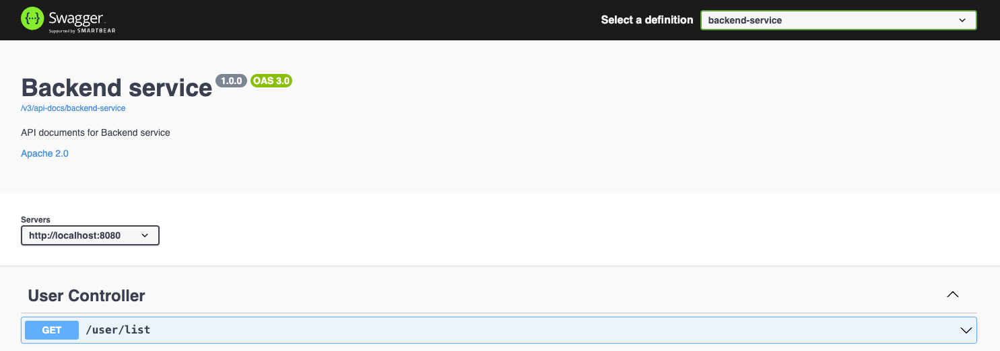

# 7. Tạo project base với spring boot 3

### 1. Kiến trúc project base
Tạo `Backend-service` với kiến trúc như sau:
```
.
├── Dockerfile
├── HELP.md
├── LICENSE
├── README.md
├── docker-compose.yml
├── initdb.sql
├── mvnw
├── mvnw.cmd
├── pom.xml
└── src
    ├── main
    │ ├── java
    │ │ └── vn
    │ │     └── tayjava
    │ │         ├── BackendServiceApplication.java
    │ │         ├── common
    │ │         ├── config
    │ │         │ └── OpenApiConfig.java
    │ │         ├── controller
    │ │         │ ├── UserController.java
    │ │         │ ├── request
    │ │         │ └── response
    │ │         ├── exception
    │ │         ├── model
    │ │         ├── repository
    │ │         └── service
    │ │             ├── UserService.java
    │ │             └── impl
    │ │                 └── UserServiceImpl.java
    │ └── resources
    │     ├── application-dev.yml
    │     ├── application-prod.yml
    │     ├── application-test.yml
    │     ├── application.properties
    │     ├── application.yml
    │     ├── banner.txt
    │     ├── static
    │     └── templates
    └── test
        └── java
            └── vn
                └── tayjava
                    └── BackendServiceApplicationTests.java
```

### 2. Các bước thực hiện
#### 2.1 Tạo mới project `backend-service`


#### 2.2 Tạo banner cho `backend-service`
```text
  ____             _                  _   ____                  _
 | __ )  __ _  ___| | _____ _ __   __| | / ___|  ___ _ ____   _(_) ___ ___
 |  _ \ / _` |/ __| |/ / _ \ '_ \ / _` | \___ \ / _ \ '__\ \ / / |/ __/ _ \
 | |_) | (_| | (__|   <  __/ | | | (_| |  ___) |  __/ |   \ V /| | (_|  __/
 |____/ \__,_|\___|_|\_\___|_| |_|\__,_| |____/ \___|_|    \_/ |_|\___\___|
```

- Tạo banner và download `banner.txt` tại [Spring Boot banner Generator | Create banner.txt online](https://springhow.com/spring-boot-banner-generator/)



- Thêm `banner.txt` vào folder `resources`
```text
    │ └── resources
    │     ├── banner.txt
    │     ├── ...
```

#### 2.3 Thiết lập maven profile để build application
- pom.xml
```xml
<profiles>
    <profile>
        <id>dev</id>
        <activation>
            <activeByDefault>true</activeByDefault>
        </activation>
        <properties>
            <spring.profiles.active>dev</spring.profiles.active>
        </properties>
    </profile>
    <profile>
        <id>test</id>
        <properties>
            <spring.profiles.active>test</spring.profiles.active>
        </properties>
    </profile>
    <profile>
        <id>prod</id>
        <properties>
            <spring.profiles.active>prod</spring.profiles.active>
        </properties>
    </profile>
</profiles>
```

- application.yml
```yml
server:
  port: 8080

spring:
  application:
    name: backend-service
  profiles:
    active: @spring.profiles.active@

management:
  endpoints:
    web:
      exposure:
        include: '*'

logging:
  level:
    root: INFO
    web: INFO
```

- application-dev.yml
```yml
spring:
  config:
    activate:
      on-profile: dev
  devtools:
    add-properties: true
  jpa:
    database-platform: org.hibernate.dialect.H2Dialect
    hibernate:
      ddl-auto: update
    show-sql: false
    properties:
      hibernate:
        format_sql: true

springdoc:
  api-docs:
    enabled: true
  swagger-ui:
    enabled: true
openapi:
  service:
    api-docs: backend-service
    server: http://localhost:${server.port}
    title: Backend service
    version: 1.0.0
```

- application-test.yml
```yml
spring:
  config:
    activate:
      on-profile: test
  devtools:
    add-properties: true
  jpa:
    database-platform: org.hibernate.dialect.H2Dialect
    hibernate:
      ddl-auto: none
    show-sql: false
    properties:
      hibernate:
        format_sql: true

springdoc:
  api-docs:
    enabled: true
  swagger-ui:
    enabled: true
openapi:
  service:
    api-docs: backend-service
    server: ${BACKEND_ENDPOINT:http://localhost:${server.port}}
    title: Backend service
    version: 1.0.0
```

- application-prod.yml
```yml
spring:
  config:
    activate:
      on-profile: prod
  devtools:
    add-properties: true
  jpa:
    database-platform: org.hibernate.dialect.H2Dialect
    hibernate:
      ddl-auto: none
    show-sql: false
    properties:
      hibernate:
        format_sql: true

springdoc:
  api-docs:
    enabled: false
  swagger-ui:
    enabled: false
```

#### 2.4 Tạo `Dockerfile` để đóng gói docker images
- Dockerfile
```bash
FROM openjdk:17

ARG JAR_FILE=target/*.jar

COPY ${JAR_FILE} backend-service.jar

ENTRYPOINT ["java", "-jar", "backend-service.jar"]

EXPOSE 8080
```

- docker-compose.yml
```bash
version: "3.9"

services:
  mysql:
    image: mysql:8.0
    container_name: mysql
    cap_add:
      - SYS_NICE
    restart: always
    environment:
      - MYSQL_DATABASE=testdb
      - MYSQL_ROOT_PASSWORD=password
    ports:
      - '3306:3306'
    volumes:
      - mysql_data:/var/lib/mysql
      - ./initdb.sql:/docker-entrypoint-initdb.d/initdb.sql
    networks:
      - default

  backend-service:
    container_name: backend-service
    build:
      context: ./
      dockerfile: Dockerfile
    ports:
      - "8080:8080"
    networks:
    - default

networks:
  default:
    name: backend-service

volumes:
  mysql_data:
```

#### 2.5 Thiết lập API document để test API

- Add dependency vào `pom.xml`
```xml
<dependency>
    <groupId>org.springdoc</groupId>
    <artifactId>springdoc-openapi-starter-webmvc-ui</artifactId>
    <version>2.2.0</version>
</dependency>
```

- Tạo class `OpenApiConfig` tại package `config` Cấu hình OpenAPI
```java
@Configuration
@Profile({"dev", "test"})
public class OpenApiConfig {

  @Bean
  public GroupedOpenApi publicApi(@Value("${openapi.service.api-docs}") String apiDocs) {
    return GroupedOpenApi.builder()
            .group(apiDocs) // /v3/api-docs/backend-service
            .packagesToScan("vn.tayjava.controller")
            .build();
  }

  @Bean
  public OpenAPI openAPI(
          @Value("${openapi.service.title}") String title,
          @Value("${openapi.service.version}") String version,
          @Value("${openapi.service.server}") String serverUrl) {
    return new OpenAPI()
            .servers(List.of(new Server().url(serverUrl)))
            .info(new Info().title(title)
                    .description("API documents for Backend service")
                    .version(version)
                    .license(new License().name("Apache 2.0").url("https://springdoc.org")));
  }

}
```

- Thiết lập cấu hình OpenAPI tại các file `.yml`
  - application-dev.yml
  ```yml
  ...
  springdoc:
    api-docs:
      enabled: true
    swagger-ui:
      enabled: true
  openapi:
    service:
      api-docs: backend-service
      server: http://localhost:${server.port}
      title: Backend service
      version: 1.0.0
  ```
  - application-test.yml
  ```yml
  ...
  springdoc:
    api-docs:
      enabled: true
    swagger-ui:
      enabled: true
  openapi:
    service:
      api-docs: backend-service
      server: ${BACKEND_ENDPOINT:http://localhost:${server.port}}
      title: Backend service
      version: 1.0.0
  ```
  - application-prod.yml
  ```yml
  ...
  springdoc:
    api-docs:
      enabled: false
    swagger-ui:
      enabled: false
  ```

#### 2.6 Viết README.md để hướng dẫn sử dụng backend-service
```text
  ____             _                  _   ____                  _
 | __ )  __ _  ___| | _____ _ __   __| | / ___|  ___ _ ____   _(_) ___ ___
 |  _ \ / _` |/ __| |/ / _ \ '_ \ / _` | \___ \ / _ \ '__\ \ / / |/ __/ _ \
 | |_) | (_| | (__|   <  __/ | | | (_| |  ___) |  __/ |   \ V /| | (_|  __/
 |____/ \__,_|\___|_|\_\___|_| |_|\__,_| |____/ \___|_|    \_/ |_|\___\___|
```
## Prerequisite
- Cài đặt JDK 17+ nếu chưa thì [cài đặt JDK](https://tayjava.vn/cai-dat-jdk-tren-macos-window-linux-ubuntu/)
- Install Maven 3.5+ nếu chưa thì [cài đặt Maven](https://tayjava.vn/cai-dat-maven-tren-macos-window-linux-ubuntu/)
- Install IntelliJ nếu chưa thì [cài đặt IntelliJ](https://tayjava.vn/cai-dat-intellij-tren-macos-va-window/)
- Install Docker nếu chưa thì [cài đặt Docker](https://tayjava.vn/cai-dat-docker-tren-macos-window-linux-ubuntu)

## Technical Stacks
- Java 17
- Maven 3.5+
- Spring Boot 3.3.4
- Spring Data Validation
- Spring Data JPA
- Postgres
- Lombok
- DevTools
- Docker, Docker compose
- ...

## Build & Run Application
- Run application bởi `mvnw` tại folder `backend-service`
```bash
./mvnw spring-boot:run
```

- Run application bởi docker

```bash
$ mvn clean install -P dev
$ docker build -t backend-service:latest .
$ docker run -it -p 8080:8080 --name backend-service backend-service:latest
```

#### 2.7 Test application
- Check health với `cURL`
```bash
curl --location 'http://localhost:8080/actuator/health'

-- Response --
{
    "status": "UP"
}
```

- Truy cập [Backend service](http://localhost:8080/swagger-ui.html) để test các API

